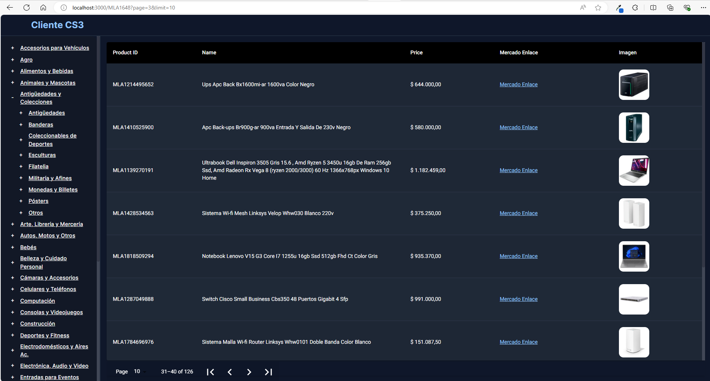
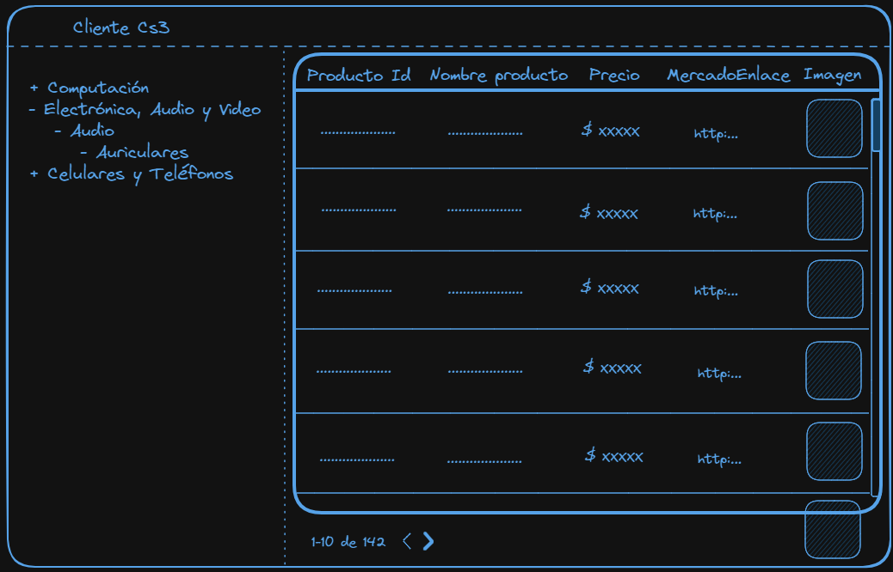

# Ejercicio de entrevista Frontend

## Presentación

Hola, soy Isai Hernandez, desarrollador frontend, esto es una prueba tecnica para una empresa que me contactó. El ejercicio consiste en desarrollar una aplicación web que muestre productos de una tienda de Mercado Libre. La aplicación debe permitir navegar entre las categorias de los productos, paginar los productos y filtrarlos, ademas de otras caracteristicas que se detallan en los requerimientos.

Se encuentra desarrollado en React.js y Next.js, con Tailwind CSS para los estilos y para la tabla Material UI.
Se utilizó el mismo next.js para el manejo de rutas API, tanto el front como el back se encuentran en el mismo proyecto.
Se revalida la información de la API de Mercado Libre cada 60 segundos, para evitar hacer consultas innecesarias. se guarda en cache.

Este proyecto se encuentra desplegado en Vercel, en el siguiente link: [https://cs3test.vercel.app](https://cs3test.vercel.app/)

## Recursos

El `Seller ID` de la tienda del cliente es `179571326`, y la API de Mercado Libre tiene un endpoint que permite buscar productos de un vendedor en particular: `https://api.mercadolibre.com/sites/MLA/search?seller_id=179571326`. Además, nos comentaron que al ingresar al endpoint desde el navegador podemos ver la respuesta en formato JSON junto con algo de información. El resto de la documentación de la API está disponible en [este link](https://developers.mercadolibre.com.ar/es_ar/items-y-busquedas).

Documentación para la paginación: [https://developers.mercadolibre.com.ar/devsite/paging-results-global-selling](https://developers.mercadolibre.com.ar/devsite/paging-results-global-selling)

## Requerimientos

- [x] Al entrar a la ruta `/` deberíamos ver un listado de los primeros 10 productos de la empresa en forma de tabla.
- [x] Al entrar a la ruta `/[category_id]` deberíamos ver un listado de productos correspondientes a esa categoría.
- [x] En todas las rutas, deberíamos ver un menú a la izquierda con las categorías disponibles. Las categorías deberían mostrarse en forma de árbol, es decir, si una categoría tiene subcategorías, deberían mostrarse como un submenú.
- [x] Las categorías deberían iniciar contraídas, y al hacer clic en un botón de `-` o `+` deberían expandirse o contraerse individualmente.
- [x] Las categorías deberían mantener su estado de expansión/contracción al navegar entre rutas.
- [x] Al hacer clic en una categoría, deberíamos navegar a la ruta `/[category_id]` correspondiente.
- [x] Al hacer clic en un producto, debería redirigirnos a la web de Mercado Libre para ese producto.
- [x] Si la consulta lo permite, la tabla debe permitir paginar de manera eficiente sobre los productos.
- [x] La paginación debe ser consultas sobre los filtros actuales de la tabla (revisar la documentación mencionada en los **Recursos de la prueba**).
- [x] Las imágenes de los productos deben tener carga perezosa.

## Preview

## Ejemplo del ejercicio

## Puntos a evaluar

- [x] UI/UX - Se puede usar cualquier herramienta de diseño: Tailwind, Framer Motion, Material UI, etc.
- [x] Las consultas deben tener un caché que muestre una consulta ya realizada y a su vez que la rehidrate si hay un cambio.
- [x] Los filtros y las paginaciones no deben excluirse.
- [x] Calidad del código y buenas prácticas.
- [ ] Claridad en los commits.
- [x] El diseño debe ser responsive (Opcional).
- [x] El listado de las filas debe ser animado (Opcional, ejemplo: [link](https://github.com/TanStack/table/discussions/2386)).

## Forma de entrega

El desarrollador debe crear un repositorio remoto en su GitHub donde irá completando los requerimientos y que posteriormente anexará en la entrega.

### Preferencialmente

1. Tener un sitio con el proyecto desplegado.
2. Subir una imagen Docker a la cual se le pueda hacer pull y probar.
